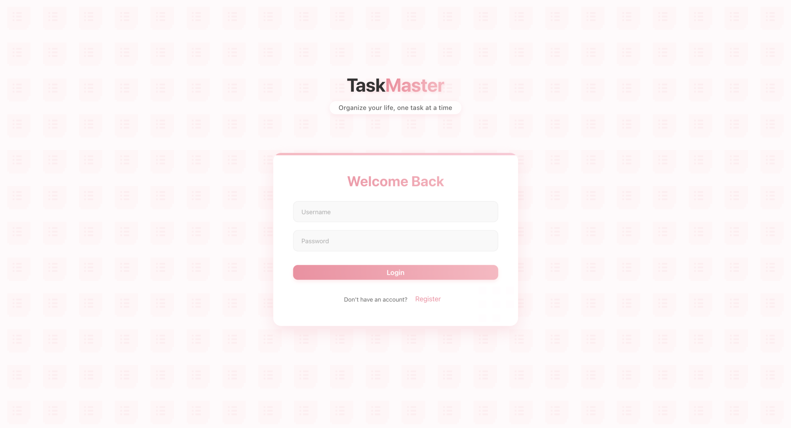
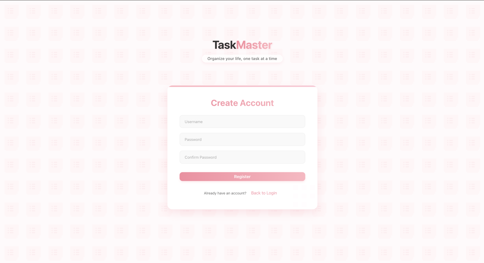
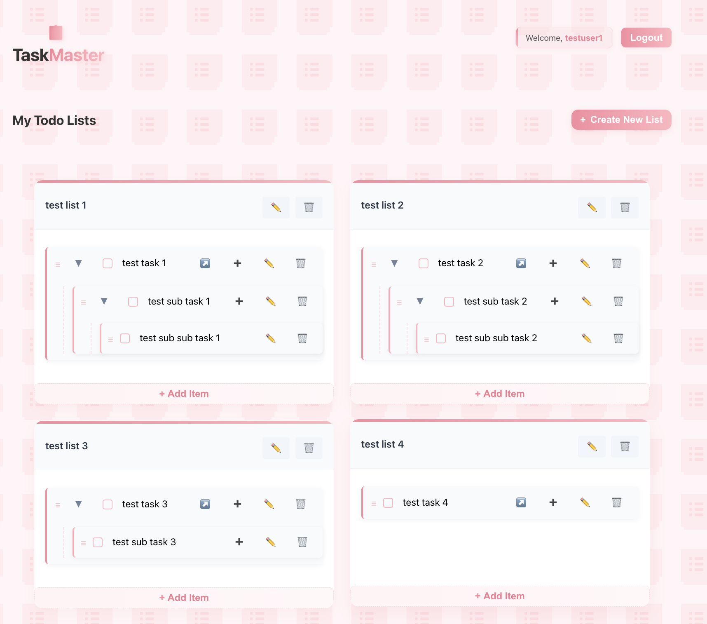

# Todo List Application

A hierarchical todo list application built with React frontend and Flask backend. This application allows users to create multiple todo lists, add items with up to 3 levels of nesting, and manage their tasks efficiently.

## Demo Video

[Watch the demo video here](https://www.loom.com/share/your-video-id) - This 3-minute video demonstrates all the features of the application.

[Access the GitHub link of this application here](https://github.com/ozcanmiraay/cs162-todo-list-app.git) - You can clone the repository and run the application locally.

## Features

- User authentication (register, login, logout)
- Create, edit, and delete multiple todo lists
- Add, edit, delete, and mark tasks as complete
- Hierarchical task structure (up to 3 levels deep)
- Drag and drop functionality for moving tasks between lists
- Responsive design for desktop and mobile devices

## Screenshots





## Prerequisites

- Python 3.8+ for the backend
- Node.js and npm for the frontend
- SQLite (included with Python)

## Installation and Setup

### Backend Setup (macOS)

```
cd backend
python3 -m venv venv
source venv/bin/activate
pip3 install -r requirements.txt
python3 run.py (or, alternatively, just python run.py)
```

### Backend Setup (Windows)

```
cd backend
python3 -m venv venv
venv\Scripts\activate.bat
pip3 install -r requirements.txt
python3 run.py (or, alternatively, just python run.py)
```

The backend server will run on http://127.0.0.1:3001

### Frontend Setup

```
cd frontend
npm install
npm start
```

The frontend will run on http://localhost:3000

## Usage

1. Register a new account or log in with existing credentials
2. Create a new todo list by clicking the "Create New List" button
3. Add items to your list using the "Add Item" button
4. Create sub-items (up to 3 levels deep) by clicking the "+" button on an item
5. Mark items as complete by clicking the checkbox
6. Edit or delete items using the buttons on each item
7. Move items between lists using drag and drop
8. Edit or delete lists using the buttons in the list header

## Project Structure

```
cs162-todo-list-app/
├── backend/                # Flask backend
│   ├── app/                # Application package
│   │   ├── __init__.py     # Initialize Flask app
│   │   ├── models.py       # Database models
│   │   └── routes.py       # API endpoints
│   ├── config.py           # Configuration settings
│   ├── requirements.txt    # Python dependencies
│   └── run.py              # Run the application
├── frontend/               # React frontend
│   ├── public/             # Static files
│   └── src/                # Source code
│       ├── components/     # React components
│       ├── styles/         # CSS styles
│       ├── App.js          # Main App component
│       └── index.js        # Entry point
└── README.md               # This file
```

## API Endpoints

- **Authentication**
  - POST /register - Register a new user
  - POST /login - Log in a user
  - POST /logout - Log out a user
  - GET /check-session - Check if user is logged in

- **Lists**
  - GET /lists - Get all lists for current user
  - POST /lists/new - Create a new list
  - PUT /list/:id - Update a list
  - DELETE /list/:id - Delete a list

- **Items**
  - POST /list/:id/item/new - Add a new item to a list
  - POST /item/:id/complete - Toggle item completion
  - PUT /item/:id - Update an item
  - DELETE /item/:id - Delete an item
  - POST /item/:id/subitem/new - Add a sub-item
  - POST /item/:id/move/:list_id - Move item to another list

## Key Components

- **Backend**
  - User Model: Handles user authentication and list ownership
  - TodoList Model: Manages todo lists with one-to-many relationship to items
  - TodoItem Model: Implements hierarchical structure with self-referential relationship

- **Frontend**
  - Dashboard: Main component displaying all user lists
  - TodoList: Component for individual lists with CRUD operations
  - TodoItem: Recursive component handling hierarchical display of items
  - DnD Integration: Drag and drop functionality for moving items

## Troubleshooting

- **Backend Issues**
  - If database errors occur, try deleting the instance folder and reinitializing the database
  - Check Flask server logs for detailed error messages

- **Frontend Issues**
  - Clear browser cache if changes aren't reflected
  - Check browser console for JavaScript errors
  - Ensure backend server is running before starting frontend

## Future Enhancements

- Task due dates and reminders
- Collaborative lists with shared access
- Dark mode theme
- Mobile application using React Native
- Data export/import functionality

## License

This project is licensed under the MIT License.

## Use of AI Tools Statement

In the development of this todo list application, I utilized the Claude AI assistant (version 3.5 Sonnet) for the following purposes:

1. **Code Implementation Assistance**:
   - Implementing drag and drop functionality for tasks
   - Creating and styling the custom drag preview
   - Fixing UI issues with dropdown menus and scrollable task names
   - Debugging and resolving various frontend issues

2. **Code Review and Optimization**:
   - Reviewing and improving code structure
   - Suggesting optimizations for better user experience
   - Helping with CSS styling and layout improvements

3. **Problem Solving**:
   - Resolving specific issues like dropdown menu positioning
   - Fixing visual bugs in the user interface
   - Implementing proper task hierarchy display

4. **Best Practices**:
   - Guidance on React component structure
   - Suggestions for state management
   - Recommendations for CSS organization

The AI was used as a programming assistant while I maintained full control over the application's design decisions, architecture, and implementation choices. All code suggestions were reviewed, understood, and integrated thoughtfully into the project. 
